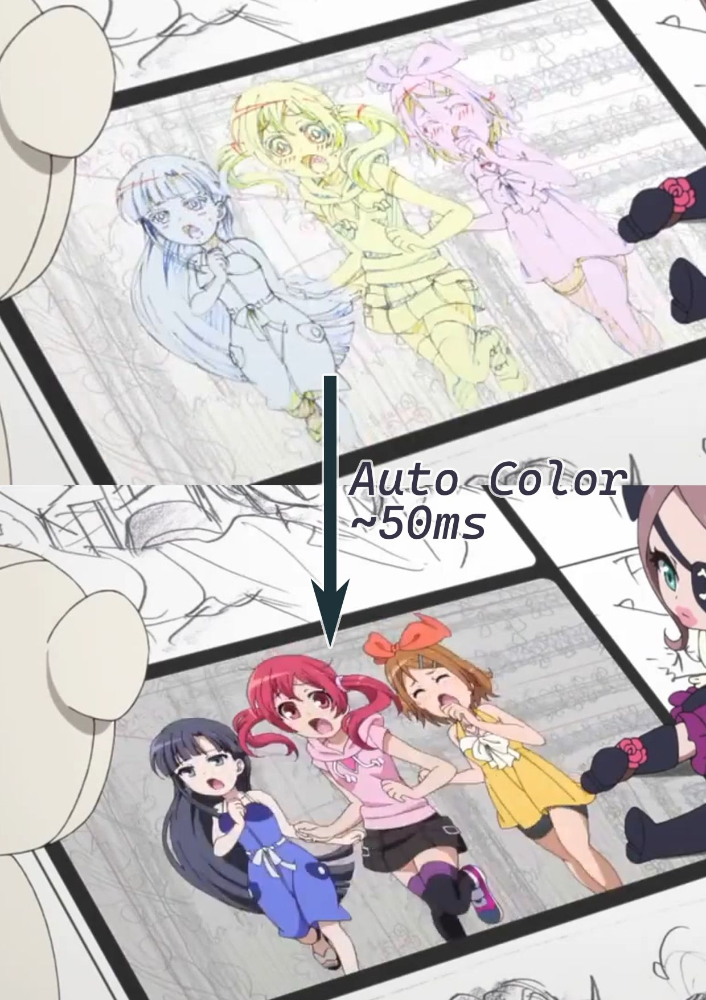

# Ciallo: Next generation digital paint/animation software

> Ciallo～(∠・ω< )⌒★!  Anime/Cartoon/2D computer graphics.

## Introduction

Ciallo aims for improving 2D artist's work efficiency with modern GPU and computational geometry. 

Name "Ciallo" is the combination of Italian "Ciao" and English "Hello", comes from the video game *Sabbat of the Witch* developed by Yuzusoft.

Different from traditional pixelmap or bezier curve based painting software, polylines/polygons are the first citizen in Ciallo. They are rendered with GPU and edited based on computational geometry algorithms. 

Why using polyline? Polylines can approximate any kind of curve, can honestly record stylus/tablet data (bezier curve always try to underfit). And applying geometry algorithms on polyline is relatively easy. 

Ciallo is greatly inspired by [Blender Grease Pencil](https://docs.blender.org/manual/en/latest/grease_pencil/introduction.html). It's a wonderful toolsets based on polyline in 3D space inside Blender. Here are some successful artworks drawn with polyline method (in blender): [GPencil open project](https://cloud.blender.org/p/gallery/5b642e25bf419c1042056fc6). Ciallo fix some fatal rendering drawbacks in blender grease pencil and try to provide more innovative tools.

For now, Ciallo is more of a personal research project. But I literally wish it could shine as an free open-source software. Artists would love to paint/animate their artworks and researchers could easily develop and test their 2D geometry/rendering algorithm in a real production environment. Help me out by staring on this project and follow up the evolution of 2D computer graphics.

## Feature Previews

- Real time "label to fill" (Bucket fill with vector strokes)
- Brush engines powered by GPU
- Curve binding for stroke editing and animating

### Real time "label to fill"

<figure>
    
 

</figure>
*Fig. - Screenshot from SHIROBAKO. It's an anime about anime making.*

Artists cannot bucket fill in a vector graphics software like Adobe Illustrator or Inkscape. Ciallo will solve the problem.

In animation industry, artists use labeling strokes to indicate how to fill colors. For example, on the upper part of the picture, blue strokes inside the character indicate fill in shadows, red strokes indicate highlights, green or yellow indicate contours need to be filled in combination with other strokes. 

Ciallo will utilize these labeling strokes for coloring. In computational geometry, [point-location problem](https://en.wikipedia.org/wiki/Point_location) is well researched and widely used in GIS and motion planning. Apparently, color filling in 2D artworks is exactly a point-location problem. 

In Ciallo, color filling is separated into three steps. First, artist paint on canvas and meanwhile arrange the polyline data. Second, query those labeling curves location and fetch desired face data (faces are polygons generated from artworks). Third, send face data to GPU for rendering a colored polygon. 

Comparing to flood fill on high resolution pixelmap, it can be 100~1000 times faster and the final artwork can be freely modified. You may intertest in [statistics on some exiting artworks](./articles/miscellaneous.md#statistics-on-existing-artworks), number of polylines and points are critical to the performance of 2D arrangements.

Similar feature offered by Krita is called "[colorize mask](https://docs.krita.org/en/reference_manual/tools/colorize_mask.html)". But it seems not fast enough for production and hard to edit the content on canvas since it's based on pixelmap. Take a look at [this video](https://www.youtube.com/watch?v=HQdx6H9BIGs) if you are interested in the problem of colorize mask.

In combination with line binding, users can animate their artworks at great ease. After modifying the labeling strokes and strokes enclose them, faces generated from strokes are updated automatically.

### Brush engines powered by GPU

*Fig. - Triangle directs upward is drawn by Articulated Line, downward is by Equidistant Dot.*

Polyline/polygon in 2D space is the counterpart of mesh in 3D space. Real time rendering on polyline could potentially save GPU from fetching GBs of texture or video. It'll make large scale animation and real time lighting in 2D games possible. And help to make better VTuber avatars ([learn more](./articles/miscellaneous.md#vtuber's-avatar)).

Inside Ciallo, "label to fill" will eat up the whole resource of a CPU core. Line editing will operation on a lot of points simultaneously. They both need heavy computation on CPU. For better user experience, it is necessary to render strokes on GPU.

Though inspired by blender grease pencil, the rendering method in Ciallo is quite different from grease pencil. The new method fix some fatal drawbacks and aim for flexibility instead of performance.

https://user-images.githubusercontent.com/24319509/182907394-b014c70b-33b3-4f8d-91f2-60aa095a5d49.mp4

*Fig. -  Attributes are editable at per vertex level.*

In July 2022, two engines are made, named as _Equidistant Dot_ and _Articulated Line_. As the name imply, _equidistant dot_ evenly place texture quad along the polyline. _Articulated line_ render a polyline as if an articulated arm. Here are some comparisons between them:

| Features                | Equidistant Dot                                              | Articulated Line                                             |
| ----------------------- | ------------------------------------------------------------ | ------------------------------------------------------------ |
| Great performance       | Yes, better than methods on CPU.                             | Yes, better than Equidistant Dot in theory.                  |
| Customization by users  | Easy. Procedural texture is not mandatory.                   | Hard. Procedural texture is mandatory. Need experience in shader development or shader graph node system. |
| Robustness to ill cases | One ill case would be pretty common (unevenly distributed vertices) and it would hit hard on rendering performance. Need help from editor to avoid it. | Better than Equidistant Dot. Pretty few ill cases I've found and they rarely happen in practice. |
| Limitations on vertices | Total amount of vertices input are limited be *maximum local workgroup size* (1024) in compute shader. Total amount of dots generated are limited by buffer size set by developers. | No limits on regular usage.                                  |

Their computations in geometry are pretty straight forward except for airbrush generated from articulated line. It needs calculus to clarify the whole idea about solving "the joint problem". I've made [a draft to explain the brush](.\articles\ContinuousAirbrushStrokeRendering.pdf) in Jan. 2022 but it's definitely too messy to read. I'll try to clean it up someday. Unless you are ultra interested in rendering an airbrush stroke on a bezier curve which takes [8 steps in illustrator](https://www.techwalla.com/articles/how-to-airbrush-in-illustrator), I do not recommend to read it carefully.

### Line binding for editing and animating

Polylines are hard to edit. So Ciallo allows users to "bind" a polyline upon bezier curve. It'll act like this:

<figure>
    
 

</figure>
*Fig. - Screenshot from the paper StrokeStrip: Joint Parameterization and Fitting of Stroke Clusters.*

The polyline keeps noise information, meanwhile bezier curve helps to edit polyline's overall shapes. When it comes to animating, bezier curve can make animation like bones in 3D after binding, which lets 2D artists reuse their data within stroke level.

Not just bezier curve, a lot of geometry tools may potentially be able to apply on polyline editing. For example, by binding a group of polyline into an oval, artist can easily animate flush on face by modifying the oval.

## Trinity

Each individual feature above doesn't make too much sense for end users: 

>- Label to fill? Clicking around with paint bucket tool is convenient enough;
>- GPU brush engines? Why bothering with very few brushes? There are so many seasoned brushes in Photoshop, Clip Studio Paint, Affinity or Krita.
>- Curve binding? Just use a bezier curve vector software like Illustrator or Inkscape.

Only the integration of three features above can make a brand new experience for users. Star on Ciallo and see more on this amazing toolset in the future.

## Working Progress

- [x] Vulkan and GUI backend setup

- [x] Naïve implementation of brush engines

  - [ ] Brush settings system

- [ ] Basic paint system
  - [ ] ...

- [ ] Arranging system (wrap up [CGAL arrangement](https://doc.cgal.org/latest/Arrangement_on_surface_2/index.html) for users)

- [ ] Binding system

  ---

- [ ] Render all icons with Ciallo's brush engine

## How to Compile

Take my great appreciation for your willingness to help on development. But Ciallo is not ready for everybody to participate in yet. Contact me if you have profound knowledge in one of these areas: DCC/paint software architecture, blender grease pencil, computational geometry, shader graph/node system.

### Windows

- Download Vulkan SDK.
- Pull vcpkg and integrate.
- Pull the codebase and run Ciallo.sln with visual studio.

### External Dependencies

- Rendering
  - Vulkan - For using some features OpenGL cannot offer.
  - Vulkan Memory Allocator
  - Vookoo - It's a thin wrapper on Vulkan. Ciallo use it for fast prototyping vulkan pipeline.
- GUI
  - Dear ImGui
  - ImPlot
- Coding Patterns
  - Entt - ECS and event system. Ciallo use ECS for writing data-operation-separated code rather than high performance.
  - range-v3
- Geometry and algebra
  - CGAL
  - GLM

## Other Potential Usage

- Help AAA games suffering from tens of GBs of texture loading.
- Offer diverse line and polygon rendering solution for UI frameworks.

## Inspired by Blender Grease Pencil

Ciallo is inspired by [blender grease pencil](https://docs.blender.org/manual/en/latest/grease_pencil/introduction.html) (gpencil). I got a lot of help from @Clément Foucault  and @Falk David  when learning the code of grease pencil system. The grease pencil system let artists draw polyline strokes in 3D space which are rendered by OpenGL. It's a great amazing tool haven't been widely accepted by artists.

Ciallo discard one dimension, which make it possible to utilize some powerful geometry tools only available on curve in 2D space like 2D arrangements, 2D generalized winding number and 2D Envelopes.

Ciallo will try to implement everything you could expect from gpencil in the future (except for 3D space), especially for curve edit/sculpt tools.

